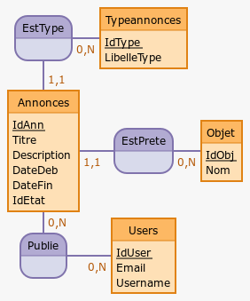
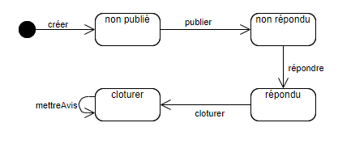
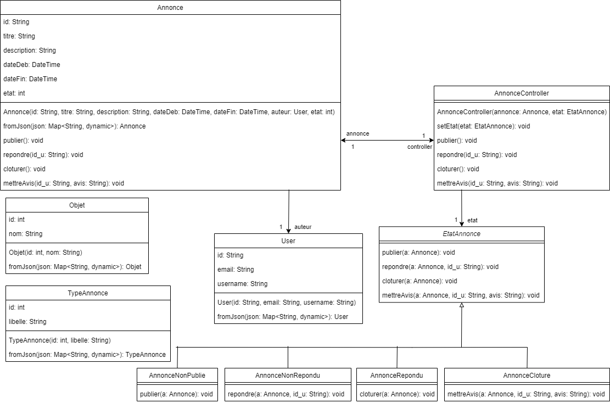

# SAE 4.04 Développement Mobile

Démonstration : https://youtu.be/yEyoxh6gZ9Y

Groupe : RABILLON Thomas, RAVIART Alexandre

## Fonctionnalité implémentée

- Authentification : Possibilité de se connecter et de s'inscrire en relation avec Supabase, et également de se déconnecter.
- Publication d’annonces : Tout les utilisateurs peuvent publier des annonces pour demander à emprunter un bien ou alors emprunter un bien en spécifiant la catégorie. Chaque annonce est stockée localement sur le smartphone avec sqflite avant d’être synchronisé sur Supabase.
- Consultation d’annonces pour prêt : Les utilisateurs peuvent consulter les annonces publiées et choisir de venir en aide en répondant à ces annonces. Le bien est alors marqué comme répondu, puis après a la fin du prêt, les annonces sont clôturées par le demandeur.
- Gestion des états d'une annonces : Utilisation du pattern state.
- Donner un avis : Les utilisateurs peuvent donner un avis sur le produit une fois l'annonce cloturé ainsi que sur le prêteur.
- Suivi des annonces : Les utilisateurs peuvent suivre l’état de leurs annonces (Répondue, Cloturer, Non Repondue) via "Mes reservations" depuis l'onglet profil.
- Suivi des prets : Les utilisateurs peuvent suivre l’état de leurs prêts via "Mes prets" depuis l'onglet profil.
- Consultation des avis : Les utilisateurs peuvent consulter les avis qu'on leurs donnent depuis la page profil.

## Lancement du projet

### Avec les commandes Flutter

```
flutter pub get
flutter run
```

### Avec Android Studio

#### Prérequis :

Un téléphone ou un émulateur. Le projet ne pourra pas fonctionner sans (sur chrome) à cause de sqflite.

## Documentations

### Modèle Conceptuel de Données des bases de données

#### Centrale :


#### Locale :



### Diagramme d’états de nos objets

#### Annonce :



### Diagramme des classes de nos objets


