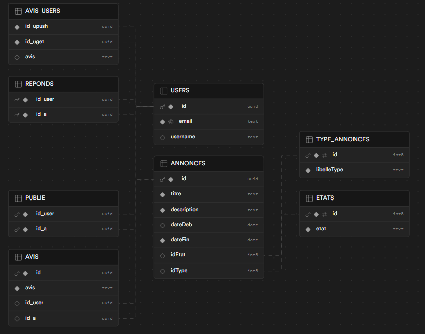

# SAE 4.04 Développement Mobile

Groupe : RABILLON Thomas, RAVIART Alexandre

## Fonctionnalité implémentée

Je sais plus

## Lancement du projet

### Avec les commandes Flutter
Si tu connais les commandes flutter :

### Avec Android Studio

#### Prérequis :

Un téléphone ou un émulateur. Le projet ne pourra pas fonctionner sans (sur chrome) à cause de sqflite.

## Documentations

### Modèle Conceptuel de Données des bases de données

#### Centrale :

#### Locale :

### Diagramme d’états de nos objets

#### Annonce :

### Diagramme des classes de nos objets

